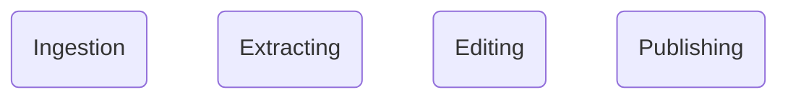
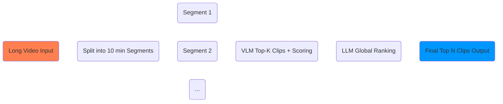

# ClipMind

ClipMind is a Streamlit-based tool for converting long-form video into AI-curated short-form clips. It uses Google Gemini models for content extraction, ranking, captioning, and reframing, plus the YouTube Data API for publishing.

## Architecture flow

## High Level pipeline


## Extracting pipeline



## What it does

- Upload a long video (`.mp4`) through the Streamlit UI.
- Segment the long video into chunks using `ffmpeg`.
- Extract high-potential short candidates with a Gemini VLM prompt.
- Rank the best clips with a Gemini LLM prompt.
- Trim the final selected shorts from the source segments.
- Apply optional editing steps: reframing, captions, audio mixing, and enhancement.
- Publish selected shorts to YouTube using OAuth credentials.

## Key files

- `app.py` — Streamlit interface and orchestration.
- `utils/config.py` — model prompts, thresholds, and publishing configuration.
- `utils/extracting.py` — video segmentation, candidate extraction, ranking, trimming, and metadata merging.
- `utils/editing.py` — video reframing, caption burning, audio mixing, enhancement, and edit pipeline.
- `utils/publishing.py` — YouTube metadata extraction and upload.


## Setup

> Note: This project uses the system `ffmpeg` tool for video clipping.
> Ensure `ffmpeg` is installed and available on `PATH`.

1. Verify `uv` is installed:

```bash
uv --version
```

If `uv` is not installed, refer to the [uv installation guide](https://docs.astral.sh/uv/getting-started/installation/).

2. Create and activate a virtual environment:

```bash
python -m venv venv
```

Then activate it:

**On Windows:**
```bash
venv\Scripts\activate
```

**On macOS/Linux:**
```bash
source venv/bin/activate
```

3. Install dependencies using `uv`:

```bash
uv sync
```

4. Ensure `ffmpeg` is installed and available:

```bash
ffmpeg -version
```

## Run

Start the Streamlit app:

```bash
streamlit run app.py
```

Then upload a `.mp4` file, and the tool will guide you through extraction, ranking, trimming, editing, and publishing.

