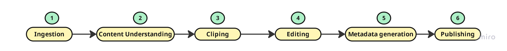

# Idea 
- The idea is developing a tool to automate shorts creation from input videos , editing and publish on Youtube
# High Level pipeline

- Based on my little research about the best length for Youtube shorts, I found the best duration is between **15s-30s**, so you can maximize the watching-time in order to get more viewers.

## Ingestion 
 
The input is a video file in mp4 format *(youtube video, TV show episode...)*

## Content understanding 

### First approach 
- Using a VLM that understand visual content and decide the epic moment(s) of the video. This methodology has a constraint especially with long videos and rate limits in free trier.

### Second approach 
- Speech extraction
- Speech to Text 
- LLM determines the epic moments.

#### Speech To text
- Choosing the right ASR model based on this [open_asr_leaderboard](https://huggingface.co/spaces/hf-audio/open_asr_leaderboard)
- The most accurate model regards to the leaderboard is [Cohere-transcribe](https://huggingface.co/CohereLabs/cohere-transcribe-03-2026), which has the lowest average WER *(Word error rate)*, and a good inference-speed (RTFx).
- This model on a CPU with an audion of **15s** it took **90s** to return the transcription. But with T4 it takes only **2s**, a 10 min audio took **25s**, regards accuracy the model done very well.

