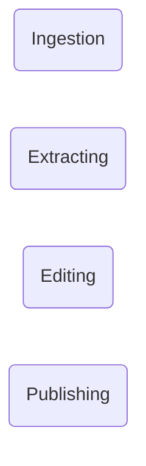
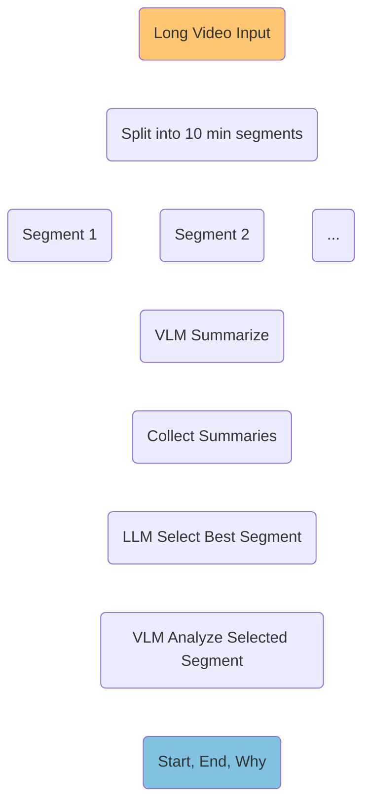
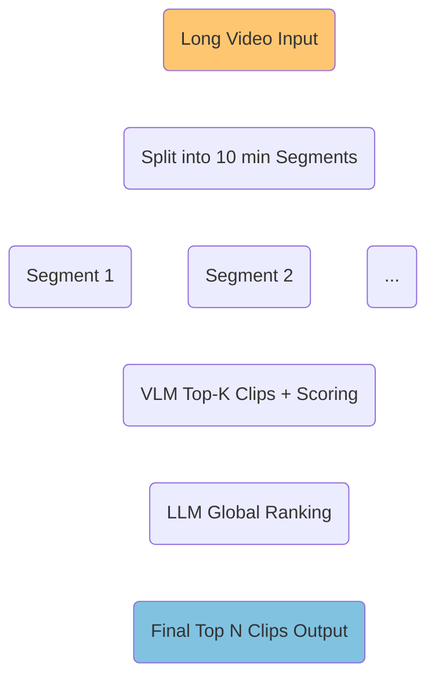
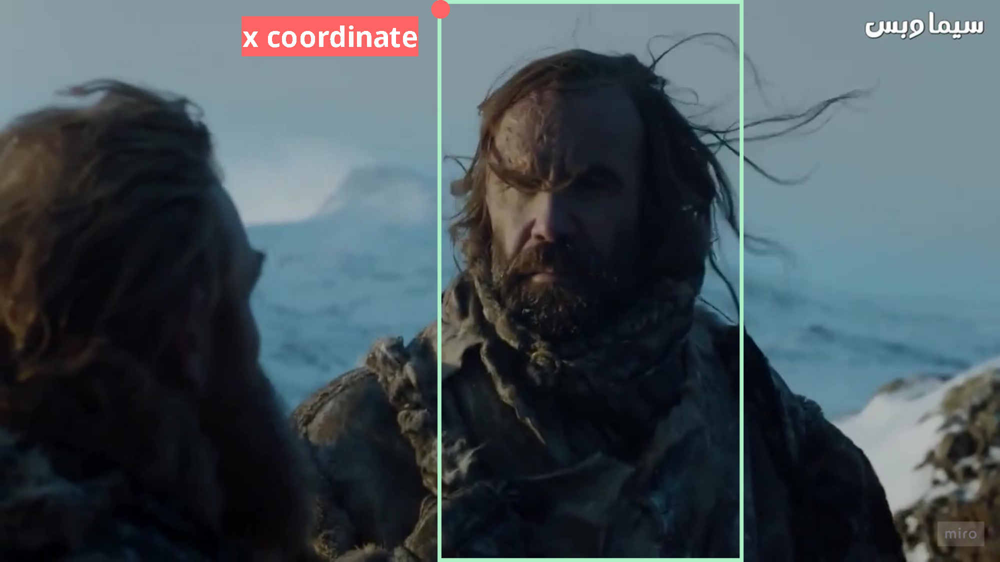

# Idea 
- The idea is developing a tool to automate shorts creation from input videos , editing and publish on Youtube
# High Level pipeline



- Based on my little research about the best length for Youtube shorts, I found the best duration is between **15s-30s**, so you can maximize the watching-time in order to get more viewers.

## Ingestion 
 
The input is a video file in mp4 format *(youtube video, TV show episode...)*

## Extracting

### First approach 
- Using a VLM that understand visual content and decide the epic moment(s) of the video. The most generous provider until now is Google Refer to [her](https://aistudio.google.com/rate-limit?timeRange=last-1-day&project=ai-shorts-tool-493100) for rate limits details.
- I tested **gemini-3-flash-preview** to summarize a 10 min interview video, and it performed very well. **gemini-3.1-flash-lite-preview** is also an option with high RPD **(of 500)**, but to be honest the summary of **gemini-3-flash-preview** is better.
- In the both previous models the context window is **250k** token. A video of 30 min consumed **172k** token, but the model hallucinate **( it repeated 4 same sentences hhh)** that was expected because of the huge context, so I think the **10 min** is suitable for the model capability.

#### First Workflow



❌ Weak summary could hide an epic short.
❌ Summaries lack hook moments (emotions, surprise...)

#### Second Workflow


#### Video's quality

Higher resolutions improve the model's ability to read fine text or identify small details, but increase token usage and latency. [Blog](https://ai.google.dev/gemini-api/docs/tokens#media-resolutions)

I used the lowest quality for Gemini input *(divisions of original video)* to minimize the context length, which is about **55k** tokens including all input *(sys prompt, prompt, segment)* and for my case model's ability was not affected. 

The problem is we should not clip the final shorts from these segments because quality is low for Youtube or other platforms. 

The solution is **[Media_resolution](https://ai.google.dev/gemini-api/docs/media-resolution)** config parameter, that determines the maximum number of tokens allocated per video frame. Using that i can use hight resolution segments with low tokens allocations, but good quality shorts.

I mapped the extracted timestamps to values in the original video using the segment_rank and duration.

### Second approach 
- Speech extraction
- Speech to Text 
- LLM determines the epic moments.

#### Speech To text
- Choosing the right ASR model based on this [open_asr_leaderboard](https://huggingface.co/spaces/hf-audio/open_asr_leaderboard)
- The most accurate model regards to the leaderboard is [Cohere-transcribe](https://huggingface.co/CohereLabs/cohere-transcribe-03-2026), which has the lowest average WER *(Word error rate)*, and a good inference-speed (RTFx).
- This model on a CPU with an audion of **15s** it took **90s** to return the transcription. But with T4 it takes only **2s**, a 10 min audio took **25s**, regards accuracy the model done very well.

## Editing

- Selected edits for now :
  - Reframing (9:16 vertical crop)
  - Background music.
  - Highlights on keywords (different colors and fonts)
  - Some video effects 
   - Contrast, Brightness 
   <!-- - Shake Effect
   - Speed Ramping -->

### Reframing 
- Reframing the short from horizontal aspect to vertical one (9:16) demand smart cropping of the original video to focus dynamically on the main object (speaker, animal, dragon...), this could be done with :

   - ❌ Online API or website like [freecropper](https://freecropper.com/), [choppity](https://www.choppity.com/features/automated-framing/)..., but free plan is very restricted 
   - ❌ Desktop apps like *CapCut* but also requires subscription and manual work.
   - ❌ python libraries like [pyautoFlip](https://github.com/AhmedHisham1/pyautoflip) (based on object recognition, face detection, speaker tracking) but the resulting cropping is not actually accurate. 

**💡 Alternative solution** 

The system uses Gemini to generate a sequence of horizontal crop positions (x-coordinates) that define where the **cropping window** should focus in each second of the video. Each x-value represents the **top-left** horizontal position of a 9:16 cropping window applied over the original video.



However, applying these values directly would cause visible **jumps** every second, since the crop position changes from one keyframe to the next.

To solve this, we apply **temporal interpolation** between consecutive x-values. Instead of switching positions discretely, we compute intermediate positions over time using a smooth function (typically linear interpolation). This transforms the list of discrete coordinates into a continuous motion path, making the crop window move fluidly across the video.

```text
x(t) = x[i] + (x[i+1] - x[i]) * (t - i)
i : 0,1,...,30
```

### Reframing 

- VLM generates a .ass (Advanced SubStation Alpha) script for styled and animated captions.
- We use the generated script with ffmpeg tool to apply the captions.
